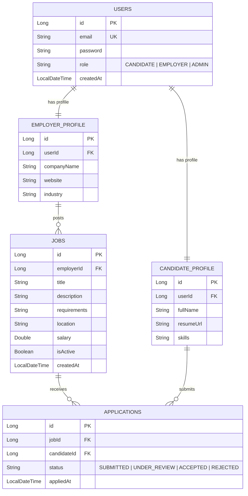

# 💼 Job Portal Platform

A modern, full-stack, enterprise-grade job board application designed to connect talent with opportunity. The platform provides tailored, secure experiences for **Candidates**, **Employers**, and **Administrators**, featuring a custom JWT-based authentication filter, role-based method security, and optimized relational database queries.


---

## 🛠️ Tech Stack & Technical Architecture

### Backend
- **Core Framework**: Spring Boot 3.2 (Java 17)
- **Security Layer**: Spring Security 6 with stateless JSON Web Tokens (JWT) for secure authentication.
- **ORM & Data Access**: Spring Data JPA & Hibernate
- **Databases Supported**: MySQL 8 (Production) / PostgreSQL
- **Notifications**: Spring Mail (automated SMTP notification dispatch)
- **API UI**: Springdoc OpenAPI / Swagger UI

### Frontend
- **Framework**: React 19 (orchestrated with Vite)
- **Styling**: Tailwind CSS (highly responsive, dynamic transitions)
- **Animations**: Framer Motion
- **Icons**: Lucide React
- **HTTP Routing**: React Router Dom v7 & Axios client

---

## 📐 System Architecture & Database Models

### System Design Flow
```mermaid
graph TD
    Client[React Frontend - Vercel] <-->|REST API / Stateless JWT| Server[Spring Boot Backend - ngrok/VPS]
    Server <-->|JPA / Hibernate ORM| DB[(MySQL/PostgreSQL)]
    Server -->|SMTP Service| Email[Spring Mail Dispatcher]
    
    subgraph Security Layer
        JWT[JWT Authentication Filter]
        RBAC[Method-Level @PreAuthorize Access Control]
    end
    Server --- Security Layer
```

### Relational Database Schema (ERD)


---

## 🚀 Advanced Backend Implementation Highlights

### 1. Robust Stateless Security & Role-Based Access Control (RBAC)
- **Custom JWT Filter**: Intercepts HTTP requests to extract, parse, and validate JSON Web Tokens in the `Authorization` header using the `jjwt` library.
- **Stateless Session Management**: Configured Spring Security to maintain zero server-side session state, utilizing stateless JWT verification for every request.
- **Granular Security Controls**: Enforces method-level security throughout the controllers using `@PreAuthorize("hasRole('ROLE_EMPLOYER')")` or `@PreAuthorize("hasRole('ROLE_ADMIN')")`.

### 2. High-Performance JPA Query Optimization
- **Avoiding N+1 Query Issues**: Utilizes JPA custom repository JPQL queries featuring explicit `JOIN FETCH` operations to retrieve user profiles and job properties in single database roundtrips.
- **Relational Integrity**: Enforces strict database-level cascading constraints (`CascadeType.ALL`, `orphanRemoval = true`) and composite database indexes for optimized search parameters.

### 3. Comprehensive Testing & Coverage
- **Service Isolation**: Automated unit tests leverage JUnit 5 and Mockito to stub out repository layers, asserting domain boundary validations and exception rules.
- **Controller Mocks**: Controller endpoints are tested using Spring `MockMvc` contexts with mock JWT scopes to thoroughly verify proper access denials for unauthorized roles.

---

## 📋 Complete REST API Specifications

### Base URL: `/api`

#### 🔐 Authentication & Identity (`/auth`)
| Method | Endpoint | Access | Description |
| :--- | :--- | :--- | :--- |
| `POST` | `/register` | Public | Create a new candidate or employer account |
| `POST` | `/login` | Public | Validate credentials and return a signed stateless JWT |
| `POST` | `/forgot-password` | Public | Dispatches a password reset link to user's registered email |
| `POST` | `/reset-password` | Public | Updates user password using a valid cryptographic reset token |

#### 👤 Profile & User Governance (`/users`)
| Method | Endpoint | Access | Description |
| :--- | :--- | :--- | :--- |
| `GET` | `/me` | Authenticated | Fetch authenticated user profile details |
| `PUT` | `/me` | Authenticated | Update user contact information or description |
| `DELETE` | `/{email}` | Admin | Permanently delete a user account from the system |

#### 💼 Job Board (`/jobs`)
| Method | Endpoint | Access | Description |
| :--- | :--- | :--- | :--- |
| `POST` | `/` | Employer/Admin | Create a new job opening listing |
| `GET` | `/` | Public | List all available jobs (Paginated) |
| `GET` | `/my` | Employer | Retrieve all listings posted by the authenticated employer |
| `PUT` | `/{id}` | Owner/Admin | Modify specific fields of a job posting |
| `DELETE` | `/{id}` | Owner/Admin | Remove a job listing |
| `GET` | `/search` | Public | Search jobs using full-text keywords with custom sorting |

#### 📄 Application Operations (`/applications`)
| Method | Endpoint | Access | Description |
| :--- | :--- | :--- | :--- |
| `POST` | `/{jobId}` | Candidate | Apply for a job posting (handles multi-part resume file uploads) |
| `GET` | `/my` | Candidate | Track application statuses submitted by the candidate |
| `GET` | `/my-applicants` | Employer | View candidate details applying for all jobs owned by employer |
| `GET` | `/job/{jobId}` | Owner/Admin | View all candidates applying for a specific job listing |
| `PUT` | `/{id}/review` | Owner/Admin | Move application state to `UNDER_REVIEW` |
| `PUT` | `/{id}/interview` | Owner/Admin | Move application state to `INTERVIEWING` |
| `PUT` | `/{id}/accept` | Owner/Admin | Move application state to `ACCEPTED` and send success email |
| `PUT` | `/{id}/reject` | Owner/Admin | Move application state to `REJECTED` and notify candidate |
| `GET` | `/{id}/resume` | Owner/Admin | Download applicant's resume file safely from disk |
| `DELETE` | `/{id}` | Candidate/Owner | Cancel/delete an application |

#### 📊 Analytical Dashboards (`/dashboard`)
| Method | Endpoint | Access | Description |
| :--- | :--- | :--- | :--- |
| `GET` | `/candidate` | Candidate | Stats: Total Applied, Accepted, Rejected, and Pending counts |
| `GET` | `/employer` | Employer | Stats: Total Jobs Active, and Pending Applications count |
| `GET` | `/admin` | Admin | Stats: System-wide Total Users, Total Active Jobs, and Applications |

---

## ⚙️ Local Installation & Configuration

### Backend Requirements
1. **Java Development Kit**: JDK 17
2. **Database Engine**: MySQL 8.x
3. **Build Tool**: Maven

#### Step 1: Update Application Settings
Configure your local environment settings inside `C:\job-portal\src\main\resources\application.properties`:
```properties
# Database Inits
spring.datasource.url=jdbc:mysql://localhost:3306/job_portal
spring.datasource.username=your_db_username
spring.datasource.password=your_db_password

# DDL Auto configurations
spring.jpa.hibernate.ddl-auto=update

# Automated Email System
spring.mail.host=smtp.gmail.com
spring.mail.port=587
spring.mail.username=your-email@gmail.com
spring.mail.password=your-gmail-app-password
```

#### Step 2: Compile & Run Server
Run the Maven wrapper to boot the backend:
```bash
./mvnw spring-boot:run
```

---

### Frontend Requirements
1. **Node.js**: v18+
2. **Package Manager**: npm

#### Step 1: Install Node Dependencies
```bash
cd frontend
npm install
```

#### Step 2: Configure Environment
Ensure your frontend API client routes requests to the correct backend host (defaults to `http://localhost:8080`).

#### Step 3: Run Dev Server
```bash
npm run dev
```

---

## 🌐 Production Deployment

- **Client Presentation**: Hosted on **Vercel** with optimized production builds.
- **Backend API Server**: Exposed via **ngrok** tunnel (during local developer testing) or hosted securely on an **AWS EC2 / VPS** instance.
- **Database Storage**: Managed relational MySQL database instance.
