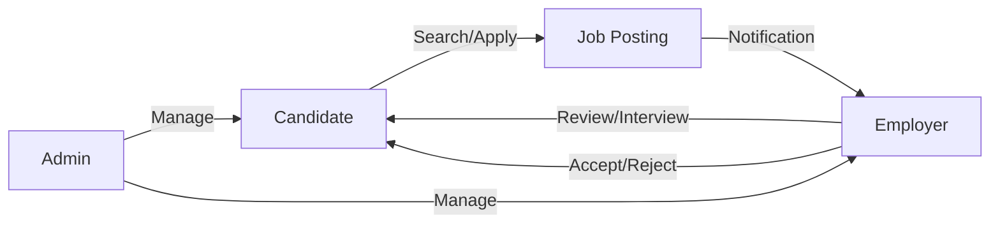

# 💼 Job Portal Platform

A modern, full-stack job board application designed to connect talent with opportunity. The platform provides tailored experiences for Candidates, Employers, and Administrators, featuring a secure JWT-based authentication system and real-time email notifications.


---

## 🚀 Features

### 👤 Candidate Experience
- **Job Discovery**: Advanced search with keyword filtering and sorting by salary/date.
- **Seamless Application**: One-click apply with resume upload functionality.
- **Application Tracking**: Personalized dashboard to monitor application statuses (Applied $\rightarrow$ Reviewed $\rightarrow$ Interviewing $\rightarrow$ Accepted/Rejected).
- **Profile Management**: Update personal details and manage account security.

### 🏢 Employer Tools
- **Job Management**: Create, edit, and delete comprehensive job postings.
- **Applicant Pipeline**: Manage candidates through a structured review process.
- **Resume Viewer**: Direct access to candidate resumes for efficient screening.
- **Employer Dashboard**: High-level overview of total jobs posted and applications received.

### 🛡️ Administration Suite
- **User Governance**: Full control over user accounts, including deletion and role management.
- **Role Promotion**: Ability to promote candidates to employers.
- **System Insights**: Global dashboard tracking total users, jobs, and applications across the platform.

---

## 🛠️ Tech Stack

### Backend
- **Language**: Java 17
- **Framework**: Spring Boot 3.2.2
- **Security**: Spring Security with JWT (JSON Web Tokens) for stateless authentication.
- **Data**: Spring Data JPA with MySQL/PostgreSQL support.
- **Communication**: Spring Mail for automated notifications.
- **Documentation**: OpenAPI/Swagger for interactive API testing.

### Frontend
- **Framework**: React 19 (Vite)
- **Styling**: Tailwind CSS for a responsive, modern UI.
- **Animations**: Framer Motion for smooth transitions.
- **Icons**: Lucide React for a consistent visual language.
- **State/Routing**: React Router Dom v7 and Axios for API orchestration.

---

## 📐 Architecture

### System Design
```mermaid
graph TD
    Client[React Frontend - Vercel] <-->|REST API / JWT| Server[Spring Boot Backend - ngrok/VPS]
    Server <-->|JPA/Hibernate| DB[(MySQL/PostgreSQL)]
    Server -->|SMTP| Email[Email Service]
    
    subgraph Security Layer
        JWT[JWT Validation]
        RBAC[Role Based Access Control]
    end
    Server --- Security Layer
```

### User Role Workflow


---

## 📑 API Specifications

### Base URL: `/api` (or root)

#### 🔐 Authentication (`/auth`)
| Method | Endpoint | Access | Description |
| :--- | :--- | :--- | :--- |
| `POST` | `/register` | Public | Create a new account (Defaults to Candidate) |
| `POST` | `/login` | Public | Authenticate and receive JWT token |
| `POST` | `/forgot-password` | Public | Request a password reset link via email |
| `POST` | `/reset-password` | Public | Update password using a valid reset token |

#### 👤 User Management (`/users`)
| Method | Endpoint | Access | Description |
| :--- | :--- | :--- | :--- |
| `GET` | `/me` | Authenticated | Fetch current user profile |
| `PUT` | `/me` | Authenticated | Update current user profile |
| `DELETE` | `/{email}` | Admin | Remove a user from the system |

#### 💼 Job Board (`/jobs`)
| Method | Endpoint | Access | Description |
| :--- | :--- | :--- | :--- |
| `POST` | `/` | Employer/Admin | Post a new job opening |
| `GET` | `/` | Public | List all available jobs (Paginated) |
| `GET` | `/my` | Employer | View jobs posted by the authenticated user |
| `PUT` | `/{id}` | Owner/Admin | Edit job details |
| `DELETE` | `/{id}` | Owner/Admin | Remove a job posting |
| `GET` | `/search` | Public | Search jobs by keyword with custom sorting |

#### 📄 Application Process (`/applications`)
| Method | Endpoint | Access | Description |
| :--- | :--- | :--- | :--- |
| `POST` | `/{jobId}` | Candidate | Apply for a job with resume upload |
| `GET` | `/my` | Candidate | View a list of personal applications |
| `GET` | `/my-applicants` | Employer | View applications for all owned jobs |
| `GET` | `/job/{jobId}` | Owner/Admin | View all applicants for a specific job |
| `PUT` | `/{id}/review` | Owner/Admin | Mark application as Reviewed |
| `PUT` | `/{id}/interview` | Owner/Admin | Mark application as Interviewing |
| `PUT` | `/{id}/accept` | Owner/Admin | Mark application as Accepted |
| `PUT` | `/{id}/reject` | Owner/Admin | Mark application as Rejected |
| `GET` | `/{id}/resume` | Owner/Admin | Download candidate's resume file |
| `DELETE` | `/{id}` | Candidate/Owner/Admin | Remove an application |

#### 📊 Dashboards (`/dashboard`)
| Method | Endpoint | Access | Description |
| :--- | :--- | :--- | :--- |
| `GET` | `/candidate` | Candidate | Stats: Applied, Accepted, Rejected, Pending |
| `GET` | `/employer` | Employer | Stats: Total Jobs Posted, Total Applications |
| `GET` | `/admin` | Admin | Stats: Total Users, Total Jobs, Total Applications |

---

## ⚙️ Installation & Setup

### Backend Configuration
1. **Database**: Create a MySQL/PostgreSQL database.
2. **Environment**: Update `src/main/resources/application.properties`:
   ```properties
   spring.datasource.url=jdbc:mysql://localhost:3306/job_portal
   spring.datasource.username=your_username
   spring.datasource.password=your_password
   # Email Configuration
   spring.mail.host=smtp.gmail.com
   spring.mail.port=587
   spring.mail.username=your-email@gmail.com
   spring.mail.password=your-app-password
   ```
3. **Run**:
   ```bash
   ./mvnw spring-boot:run
   ```

### Frontend Configuration
1. **Install Dependencies**:
   ```bash
   cd frontend
   npm install
   ```
2. **API URL**: Update the axios base URL to match your backend (e.g., `http://localhost:8080` or your ngrok URL).
3. **Run**:
   ```bash
   npm run dev
   ```

---

## 🌐 Deployment

- **Frontend**: Deployed on **Vercel**.
- **Backend**: Exposed via **ngrok** (for development) or hosted on a VPS.
- **CI/CD**: GitHub Actions recommended for automated testing and deployment.

---

## 🤝 Contributing

1. Fork the Project
2. Create your Feature Branch (`git checkout -b feature/AmazingFeature`)
3. Commit your Changes (`git commit -m 'Add some AmazingFeature'`)
4. Push to the Branch (`git push origin feature/AmazingFeature`)
5. Open a Pull Request
